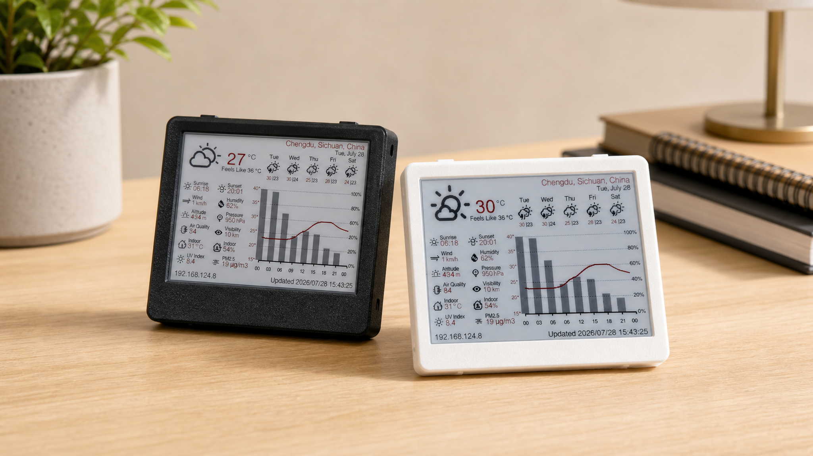
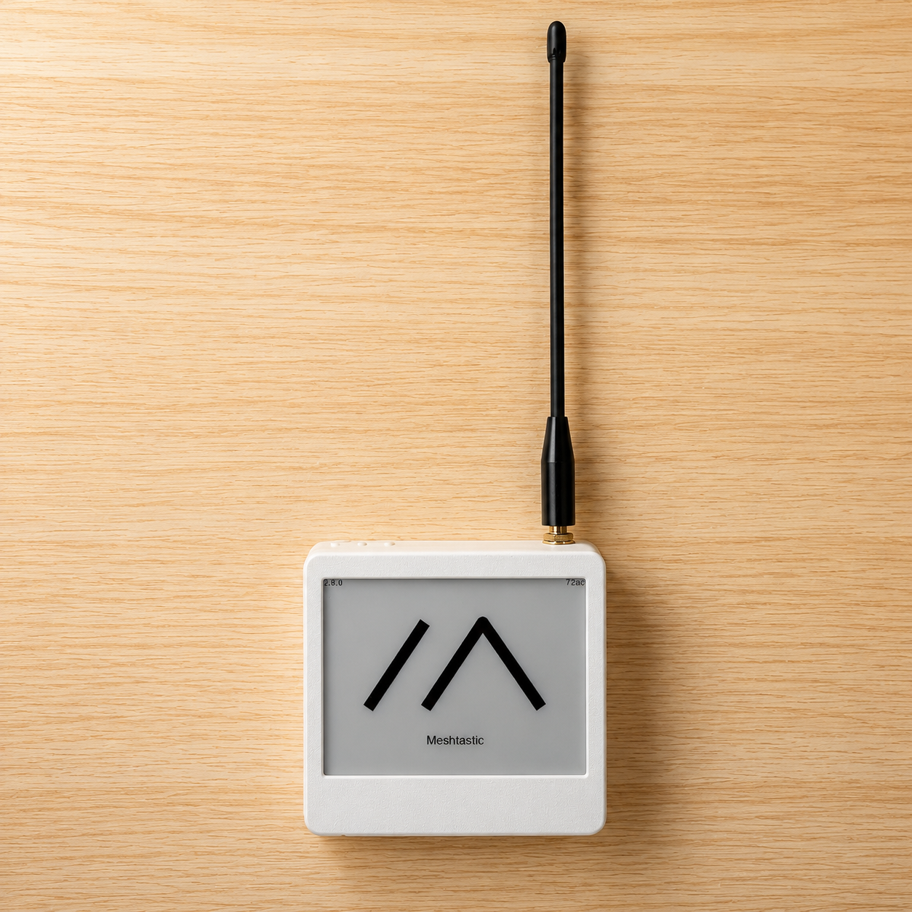
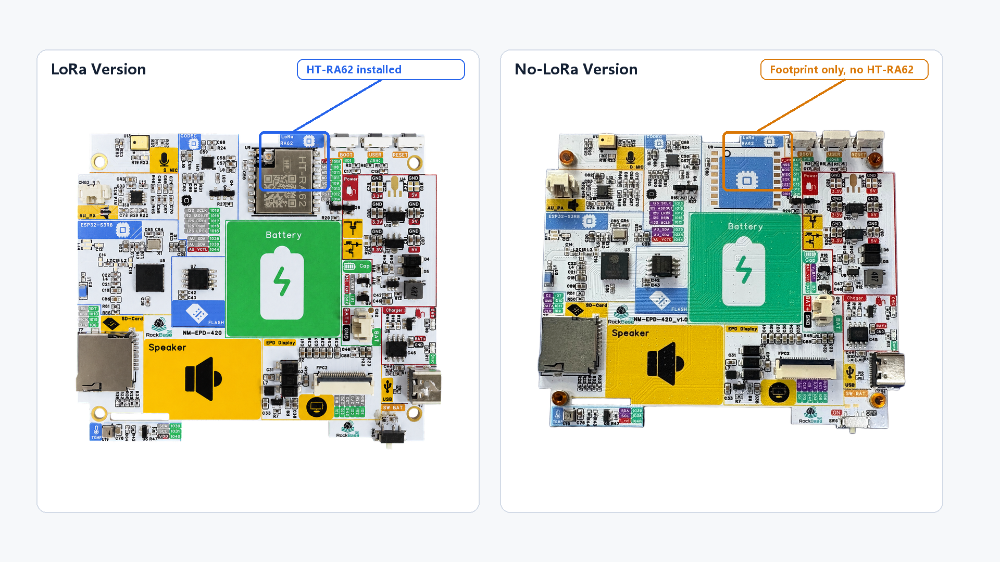
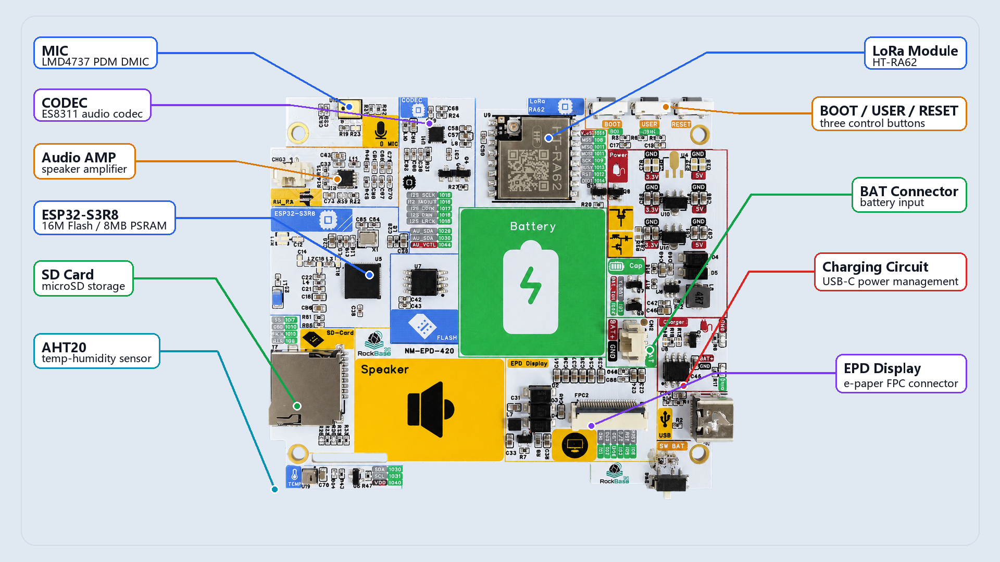
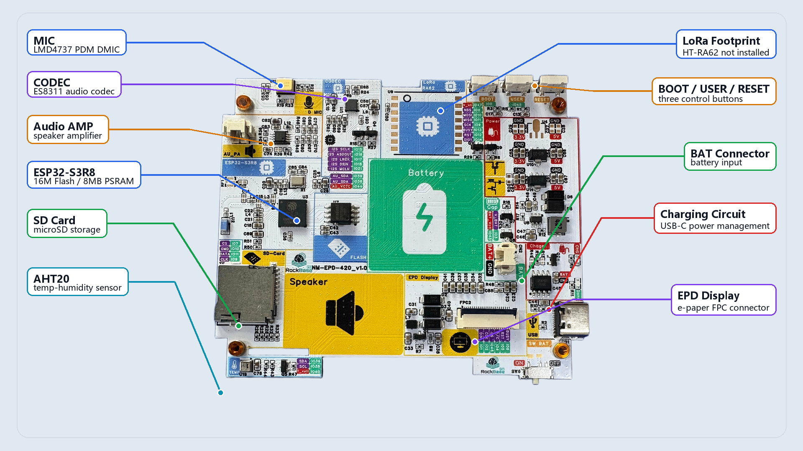

# NM-EPD-420

The **NM-EPD-420** is an **ESP32-S3** based 4.2-inch tri-color E-ink development board. It integrates Wi-Fi / BLE, LoRa, audio codec, temperature/humidity sensing, SD card, battery management, and other common peripherals — a ready-to-use hardware platform for low-power info panels, weather stations, Meshtastic terminals, dashboards, and more.

> The firmware in this repository is a **factory test firmware**. Its only purpose is to help the production line or a developer quickly verify that all on-board peripherals work after powering on. See [Section 4](#4-factory-test-firmware) for the test sequence, workflow, and build instructions.
>
> 中文版本: [README_cn.md](README_cn.md)

---

## 1. Board overview

The NM-EPD-420 packs the core resources needed for E-ink projects onto a single board:

* **MCU**: ESP32-S3 (16 MB Flash, PSRAM, dual-core 240 MHz, 2.4 GHz Wi-Fi and BLE 5)
* **Display**: 4.2" 400×300 tri-color E-ink panel (black / white / red), model **GDEY042Z98**; black-and-white E-ink panel (GxEPD2_420_GYE042A87), same pinout, driver library can be swapped directly.
* **Audio**: ES8311 audio codec + external Class-D amplifier + onboard speaker, plus an LMD4737 PDM digital microphone
* **Environment sensor**: AHT20 temperature/humidity sensor with independent power switch
* **Wireless extension**: Header for **SX126x** family LoRa modules (shares SPI bus with the SD card) (optional)
* **Storage & I/O**: µSD card slot, USER / BOOT buttons, battery ADC, JST 1.25 2-Pin battery connector
* **Low-power design**: Independent enable pins for each peripheral module allow complete power-down before ESP32 deep sleep

You can run one of the already-supported projects listed below, or treat the NM-EPD-420 as a general ESP32-S3 carrier and start your own application using the pin definitions in this document.

### Display refresh performance

The NM-EPD-420 is available with either the tri-color GDEY042Z98 panel or the black-and-white GYE042A87 panel:

- **GDEY042Z98 tri-color panel**:
  - **SKU: NM-EPD-420**
  - Full refresh (black / white / red) takes approximately 10 seconds; partial refresh is not supported.
  - The tri-color panel provides richer visuals for weather stations, dashboards, and similar applications, but refreshes more slowly and is best suited to mostly static content.
  - The standard NM-EPD-420 tri-color version does not include a LoRa module and is intended for general desktop applications.

- **GYE042A87 black-and-white panel**:
  - **SKU: NM-EPD-420-BW**
  - Full refresh (black / white) takes approximately 2-3 seconds, with partial refresh supported in approximately 1 second.
  - The black-and-white panel is recommended for applications that need faster content updates.
  - The NM-EPD-420-BW version is suitable for fast-refresh applications and includes LoRa support by default, making it suitable for indoor desktop LoRa nodes.

---

## 2. Already supported open-source projects

The following projects have been ported to the NM-EPD-420. Clone the linked branch and build:

| Project | Description | Adapted repository / branch |
|---------|-------------|-----------------------------|
| **Meshtastic** | Off-grid LoRa mesh messaging; shows node info, messages, and sensor data on the 4.2" E-ink panel (HT-RA62 module, SX1262) | [RockBase-iot/meshtastic-firmware@`nm-epd-420`](https://github.com/RockBase-iot/meshtastic-firmware/tree/nm-epd-420) |
| **TRMNL-Firmware** | TRMNL E-ink content framework; fetches images/content from a server on a schedule | [RockBase-iot/trmnl-firmware@`nm-epd-420`](https://github.com/RockBase-iot/trmnl-firmware/tree/nm-epd-420) |
| **Biscuit** | Multi-purpose tool / entertainment firmware for E-ink devices | [RockBase-iot/biscuit@`master`](https://github.com/RockBase-iot/biscuit/tree/master) |
| **ESP32-weather-epd** | Low-power weather station; fetches data from OpenWeatherMap and displays it on E-ink | [RockBase-iot/esp32-weather-epd@`main`](https://github.com/RockBase-iot/esp32-weather-epd/tree/main) |
| **ESP32-Dashboard** | Multi-function E-ink dashboard: weather, air quality, indoor T/RH, Web config portal, etc. | [RockBase-iot/ESP32-Dashboard@`main`](https://github.com/RockBase-iot/ESP32-Dashboard/tree/main) |
| **MeshCore** | Lightweight, low-power LoRa gateway firmware | [RockBase-iot/meshcore-firmware@`nm-epd-420`](https://github.com/RockBase-iot/meshcore-firmware/tree/nm-epd-420) |

**Application firmware for the related projects is already available on [RockBase IoT Web Flash](https://flash.rockbaseiot.com).**





---

## 3. Hardware resources and pin definitions

### 3.1 Block diagram

```
                      ┌───────────────────────────────────┐
                      │             ESP32-S3              │
                      │  (16 MB Flash, PSRAM, BLE/Wi-Fi)  │
                      └───────────────────────────────────┘
        SPI2 (FSPI) ──┐    SPI3 (HSPI) ──┐    I²C ──┐    I²S ──┐
                      ▼                  ▼          ▼          ▼
              ┌──────────────┐    ┌──────────┐  ┌──────┐  ┌────────┐
              │ EPD GDEY042  │    │ µSD card │  │AHT20 │  │ ES8311 │ → PA → SPK
              │   Z98 (3C)   │    │  + LoRa  │  └──────┘  │  codec │ ← DMIC LMD4737
              │  400×300 4.2"│    │  modem   │            │        │
              └──────────────┘    └──────────┘            └────────┘

  ┌────────┐  ┌────────┐  ┌──────────────┐
  │  USER  │  │  BOOT  │  │ Battery ADC  │
  │ button │  │ button │  │  IO43+IO3    │
  └────────┘  └────────┘  └──────────────┘
```

### 3.2 Bill of materials

| Block        | Part                          | Interface       | Notes                                 |
|--------------|-------------------------------|-----------------|---------------------------------------|
| MCU          | **ESP32-S3** (qio_opi PSRAM)  | —               | 16 MB flash, dual-core 240 MHz        |
| E-paper      | **GDEY042Z98** 4.2" 400×300   | SPI (FSPI)      | Tri-color B/W/R, GxEPD2 driver        |
| Codec        | **ES8311**                    | I²C 0x18 + I²S  | DAC out → external PA → 8 Ω speaker   |
| Mic          | **LMD4737** PDM DMIC          | I²S (DMIC mode) | Sample rate 16 kHz                    |
| T/RH sensor  | **AHT20**                     | I²C 0x38        | Power-gated via `PIN_TEMP_CTL`        |
| SD card      | µSD                           | SPI (HSPI)      | Shared bus with LoRa                  |
| LoRa modem   | HT-RA62 **SX1262** family     | SPI (HSPI)      | CS / RST / BUSY / DIO1 GPIOs          |
| Buttons      | USER, BOOT                    | GPIO            | Active LOW, external pull-up          |
| Audio amp    | External Class-D              | EN GPIO         | Enabled by `PIN_PA_CTRL` HIGH         |

### 3.3 ESP32-S3 GPIO map

> Authoritative source: [src/config.h](src/config.h).

| Group           | Signal           | GPIO | Direction | Notes                                   |
|-----------------|------------------|------|-----------|-----------------------------------------|
| EPD (FSPI)      | SCK              | 2    | OUT       |                                         |
|                 | MOSI             | 1    | OUT       |                                         |
|                 | MISO             | —    | —         | Panel pin NC (write-only)               |
|                 | CS               | 46   | OUT       |                                         |
|                 | DC               | 4    | OUT       |                                         |
|                 | RST              | 5    | OUT       |                                         |
|                 | BUSY             | 6    | IN        | HIGH while refresh in progress          |
| SD + LoRa (HSPI)| SCK              | 9    | OUT       | Shared bus                              |
|                 | MOSI             | 10   | OUT       |                                         |
|                 | MISO             | 11   | IN        |                                         |
|                 | SD CS            | 7    | OUT       |                                         |
|                 | LoRa NSS         | 8    | OUT       |                                         |
|                 | LoRa RST         | 12   | OUT       |                                         |
|                 | LoRa BUSY        | 13   | IN        |                                         |
|                 | LoRa DIO1        | 14   | IN        | Used by specific LoRa applications      |
| I²S (ES8311)    | MCLK             | 21   | OUT       | 4.096 MHz (256 × 16 kHz)                |
|                 | BCLK             | 15   | OUT       |                                         |
|                 | LRCK / WS        | 17   | OUT       |                                         |
|                 | DOUT (ESP→DAC)   | 18   | OUT       | ES8311 DSDIN                            |
|                 | DIN  (ADC→ESP)   | 16   | IN        | ES8311 ASDOUT                           |
| I²C             | SDA              | 39   | I/O       | AHT20 + ES8311 shared bus               |
|                 | SCL              | 38   | OUT       |                                         |
|                 | TEMP_CTL         | 40   | OUT       | AHT20 power gate (HIGH = on)            |
| Audio           | PA_CTRL          | 41   | OUT       | External amplifier enable               |
| User I/O        | USER button      | 45   | IN        | Active LOW, external pull-up            |
|                 | BOOT button      | 0    | IN        | Active LOW, RTC GPIO, external pull-up  |
| Module EN       | LoRa EN          | 47   | OUT       | LoRa module power enable (HIGH = on)    |
|                 | Codec EN         | 44   | OUT       | ES8311 power enable (HIGH = on)         |
|                 | ADC EN           | 43   | OUT       | Battery ADC circuit enable (HIGH = on)  |
| Battery ADC     | BATT_ADC         | 3    | IN        | Battery voltage sense (resistor divider)|

*Note: Applications may use different peripherals. Control unused peripherals through their enable pins to optimize power consumption.*



The LoRa version includes an HT-RA62 module (SX1262) for Meshtastic, MeshCore, and other LoRa applications. The no-LoRa version does not include the module and is intended for general applications. The NM-EPD-420-BW version supports LoRa by default so LoRa applications can benefit from its faster display refresh.





### 3.4 Accessories and power

* **3D case**: STL files are in [docs/case](docs/case), including buttons, top plate, back cover, etc.
* **Battery**: A 3.7 V Li-Po battery with protection circuit, capacity ≥ 500 mAh, is recommended. The PCB has a JST 1.25 PH 2-Pin connector (red = positive, black = negative). Recommended size: 603030. [Buy on AliExpress JST 1.25 2Pin 603030 600mAh](https://www.aliexpress.com/item/32853151195.html)

---

## 4. Factory test firmware

The firmware in this repository exercises every on-board peripheral in a fixed sequence (T0…T11). It renders a dedicated screen for every step and lets the operator confirm / reject each step with the **USER** and **BOOT** buttons. At the end, a one-page summary screen lists every test as PASS / FAIL / SKIP.

### 4.1 Test sequence

| Test | Item            | Description                                  | Screen |
|------|-----------------|----------------------------------------------|--------|
| T0   | System startup  | Serial / EPD init, welcome screen, wait USER |  |
| T1   | EPD display     | White / Black / Red fill + text demo         | — |
| T3   | Buttons         | USER key and BOOT key press detection        | — |
| T4   | ES8311 codec    | Sweep 500/1k/2k/3k Hz + *Ode to Joy* melody  |  |
| T5   | DMIC mic        | Voice record + speaker loopback + RMS check  |  |
| T6   | AHT20 sensor    | Temperature & humidity over I²C              |  |
| T7   | Battery ADC     | Battery divider voltage on IO3 (enable IO43) | — |
| T8   | Wi-Fi scan      | 2.4 GHz AP scan, expect ≥ 1 network          |  |
| T9   | SD card R/W     | HSPI mount + write / read-back verify        |  |
| T10  | LoRa SPI bus    | Reset modem, check BUSY low                  | — |
| T11  | Summary         | Per-item PASS/FAIL/SKIP table + EPD hibernate + deep sleep |  |

A complete run typically takes ~3 min, dominated by EPD full-refresh time (~10 s per page on a 3-color panel).

### 4.2 Operator workflow

```
                  ┌───────────────────────────┐
   power on  ───► │  T0  Welcome              │  press USER
                  └───────────────────────────┘
                             │
                             ▼
                  ┌───────────────────────────┐
                  │  T1 … T10                 │
                  │  for each test:           │
                  │    show screen            │
                  │    run hardware           │
                  │    USER = PASS / OK       │
                  │    BOOT = FAIL            │
                  └───────────────────────────┘
                             │
                             ▼
                  ┌───────────────────────────┐
                  │  T11  Summary             │  EPD hibernate → ESP32 deep sleep
                  └───────────────────────────┘
```

Buttons are debounced (5 × 10 ms samples) and gated against EPD `BUSY` so a press during a refresh cannot be consumed as a verdict for the next test.

### 4.3 Build & flash

Prerequisites: PlatformIO Core (command line) or VS Code + PlatformIO extension.

```powershell
# In the repository root:
$env:IDF_GITHUB_ASSETS = "dl.espressif.cn/github_assets"   # optional, China mirror
pio run                                                    # build
pio run --target upload --upload-port COM38                # flash
pio device monitor --baud 115200                           # serial console
```

The first build downloads the ESP-IDF toolchain (~hundreds of MB) into `%USERPROFILE%\.platformio`. Subsequent builds take ~25 s.

Typical serial output during a run:

```
[FACTORY TEST] Board: NM-EPD-420
[FACTORY TEST] FW: v1.4.01
[FACTORY TEST] T0 - System startup OK
…
[FACTORY TEST] T1 START - EPD Display
[T1] Round 1/4 - Filling screen WHITE ...
[T1] BUSY self-check: sawHigh=1  highMs=2873
…
[FACTORY TEST] ===== SUMMARY =====
[FACTORY TEST] T1   EPD Display    [PASS]
…
[FACTORY TEST] Overall: FACTORY_TEST=OK
```

---

## 5. Developing your own project on NM-EPD-420

This board is essentially a fully-featured ESP32-S3 carrier. To start your own project:

1. Pick one of the already-supported projects from [Section 2](#2-already-supported-open-source-projects) and clone the corresponding branch, or create a fresh PlatformIO / Arduino project.
2. Copy the pin configuration below into your project's `config.h` or `platformio.ini`. For PlatformIO projects, see the `codes` directory; `nm_epd_420.json` already defines the board pin mapping and can be referenced directly.
3. Initialize the SPI / I²C / I²S buses as needed. Remember: **EPD uses FSPI, SD + LoRa share HSPI**.
4. Drive the corresponding module-enable pin HIGH before using a peripheral, and LOW afterwards to save power.
5. Use `esp_deep_sleep_start()` or similar APIs for low-power operation.

### 5.1 Common peripheral initialization notes

* **E-paper**: Use the `zinggjm/GxEPD2` library with the `GxEPD2_420c_GDEY042Z98` driver for the default tri-color NM-EPD-420 (CS=46, DC=4, RST=5, BUSY=6). For the black-and-white NM-EPD-420-BW, use the `GxEPD2_420_GYE042A87` driver.
* **AHT20**: Use `Adafruit AHTX0`; I²C SDA=39, SCL=38; set `PIN_TEMP_CTL(40)` HIGH before reading.
* **ES8311 / speaker / microphone**: I²C address 0x18, I²S pins as in the table above; drive `PIN_CODEC_EN(44)` and `PIN_PA_CTRL(41)` HIGH before playback.
* **SD card**: Use the `SD` library + HSPI (SCK=9, MOSI=10, MISO=11, CS=7).
* **LoRa**: SX126x family on the shared HSPI bus; CS=8, RST=12, BUSY=13, DIO1=14; drive `PIN_LORA_EN(47)` HIGH before use.
* **Battery ADC**: Drive `PIN_ADC_EN(43)` HIGH, read from `PIN_BATT_ADC(3)`, divide ratio is 2:1.

### 5.2 Software architecture (test firmware)

If you need to modify or extend the factory test firmware, the source is organized as follows:

```
src/
├── main.cpp              ← Arduino entry; disables task WDT, calls runner.run()
├── test_runner.{h,cpp}   ← T0/T11, button helpers, EPD pre-test resync, dispatch
├── config.h              ← Pin map + feature switches (the single source of truth)
├── spi_buses.h           ← Shared HSPI bus init for SD + LoRa
├── ui/
│   └── display_helper.h  ← EPD wrapper + showWelcome / showTestScreen
└── tests/
    ├── test_t1_epd.h     ← header-only test implementations
    ├── …
    └── test_t10_lora.h
```

Design notes:

* **Single-threaded, blocking.** The factory line is human-paced; using `delay()` and synchronous SPI/I²S keeps the code linear and easy to debug.
* **Tests are header-only.** Each `test_tN_*.h` exposes `TestResult runTestTN(Display&, TestRunner&)` and is included once from `test_runner.cpp`. No virtual dispatch.
* **EPD resync between tests.** `TestRunner::_preTest()` re-runs `_epd.init(..., initial_power_on=true, ...)` so peripheral tests that touch shared resources (Wi-Fi RF cal, HSPI for SD, …) cannot leave the EPD in a desynced state.
* **Button gating against EPD BUSY.** All button reads are debounced (5 × 10 ms) and rejected while `PIN_EPD_BUSY` is HIGH, so a press during the ~10 s full-window refresh cannot leak into the next verdict.

### 5.3 Frameworks & libraries

| Layer               | Version                                        |
|---------------------|------------------------------------------------|
| Build system        | **PlatformIO**                                 |
| Platform            | `pioarduino/platform-espressif32` **54.03.21** |
| Framework           | Arduino-ESP32 **3.2.x** (on top of ESP-IDF 5.4)|
| Language            | C++17                                          |

Library deps (see [platformio.ini](platformio.ini)):

| Library                            | Version | Used by   |
|------------------------------------|---------|-----------|
| `zinggjm/GxEPD2`                   | 1.6.8   | EPD       |
| `adafruit/Adafruit AHTX0`          | 2.0.5   | T6 sensor |
| `adafruit/Adafruit BusIO`          | 1.17.4  | (dep)     |
| `adafruit/Adafruit Unified Sensor` | 1.1.15  | (dep)     |
| `SPI`, `Wire`, `WiFi`, `SD`        | 3.2.1   | bundled   |
| `Adafruit GFX Library`             | 1.12.6  | (dep)     |

### 5.4 Sharing your code

If you want to share your code with the community more quickly, check out the [RockBase IoT ESPWebApps](https://github.com/RockBase-iot/ESPWebApps) project. Develop your application following the existing framework and conventions, and users will be able to flash it online through [RockBase IoT Web Flash](https://flash.rockbaseiot.com).

---

## 6. Repository layout

```
NM-EPD-420/
├── README.md            ← this file
├── README_cn.md         ← Chinese version
├── platformio.ini       ← PlatformIO build configuration
├── docs/                ← Design/debug notes, 3D case files
├── image/               ← Screen captures shown in this README
│   ├── T0.png  T2.png  T4.png  T5.png  T6.png  T8.png  T9.png  T11.png
└── src/                 ← All firmware sources
```

---

## 7. Where to buy

The first batch of NM-EPD-420 units went on sale as scheduled in August 2026 and is now available for order. You can purchase through the following channels:

* [Amazon RockBase IoT](https://www.amazon.com/gp/product/B0H1QCHMW6)
* [RockBase IoT Store](https://www.aliexpress.com/store/1105401362)
* [RockBase Shop](https://rockbase.shop/products/nm-epd-420/)
* [NMTech Global Store](https://www.aliexpress.com/store/1104265822)
